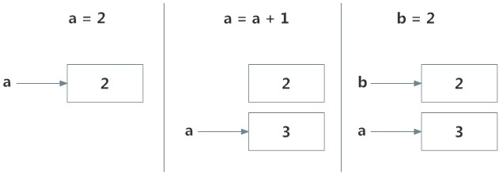
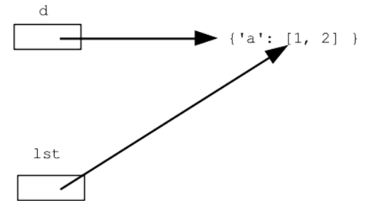

# 3. Assignment and nature of variables
Created Saturday 17 October 2020

#### Basic(Memory allocation)

* Python keeps a single instance(in memory) for basic variables. i.e x = 2; y = 2; point to the same location. Even z = 1 + 1 points to that location. Example - int, string.
* Python keeps separate copies for non-basic types - list, dict etc.

Demo - ``id`` returns a 'memory address' equivalent, it is unique.
	x = 2
	y = 1+1
	z = 2 - 0
	id(x)==id(y)==id(z) # True, basic types
	
	x = [1, 2, 3]
	y = [1, 2, 3]
	id(x)==id(y) # False, this is not a basic type

Note:

* Pooling is for basic types only. Fun fact: due to pooling nature of basic types, operations are not in-place - they always return a value.

#### Assignment(no copy)

* All assignments are references(alias). Python does shallow copy - new memory is not allocated.
* Only one caveat - pooling, discussed before. Criteria - data type.

Note:

* No copy holds for:
	* nested variables
	* Parameters(i.e caller and function share memory)
	* Return values

* Use **obj.copy()** for a deep copy.
* use keyword '**is**' to check if variables are aliases.
* **==** does bit by bit comparison, except for functions - where False is returned, because comparison is undecidable.

*****

#### Augmented Assignment

1. +, *, =, %, //, **
2. In C/C++ and Java, augmented assignment is a pure syntax sugar. But python creates a buffer variable if we use long hand assignment. Augmented is in-place and hence fast.
3. Can be used universally, i.e used for strings too.
4. Other operators are &=, ^=, |=, <<=, >>=

#### Walrus operator(assignment expressions)
Just like C++, C, JS we can operate on an assignent expression, which first replaces the expression with the calculated value.

* Available in Python3.8+
* Syntax - The assignment operator(=) with a colon before it. No spaces.

	(x=2)*3 # Error before Python3.8
	(x:=2)*3 # x has become 2, result 6
	(x:=2*2+1)*x # 25

