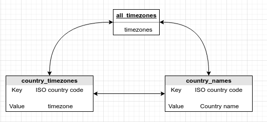

# 4. pytz
Created Wednesday 20 May 

Python timezone library is installed. **Only this library that has general timezone info.**
It is a module that is constantly updated, a definitive source for time information.
Some useful lists are:

1. pytz.**timezone(**country_time_zone**) **returns the timezone which is can be used in **tz**, it is not a string.
2. Most datetime functions take the **tz **default argument, which specifies the timezone. Dont' provide a string directly, use tz.timezone()

	tz_display = pytz.timezone('Europe/Moscow')	# pass a string, get a usable timezone
	local_time = datetime.datetime.now(tz=tz_display)

3. pytz.**all_timezones** - returns the **view** **list** of all timezones(names).
4. pytz.**country_names **- returns a **view dictionary** of country codes and their full names(mentioned only here).
5. pytz.**country_timezones ** - returns a **view dict** of country code and timezone names.

Note: All pytz non-functions are **two worded**, the second word being a **plural**.
[pytz code](./4._pytz/tztest.py)
[naive world_clock_program.py](./4._pytz/world_clock_program.py)

*****

**Naive** - an object unaware of DST
**Aware** - an object that takes DST into account

*****

pytz can help us display things according to dst with the **localize**() function. This makes an object which has the **tzinfo **attribute.
	naive_local_time = datetime.datetime.now()
	pytz.utc.localize(naive_local_time) # maid: dst w.r.t

