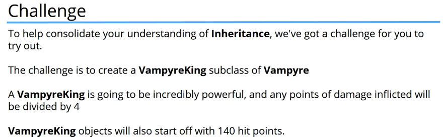
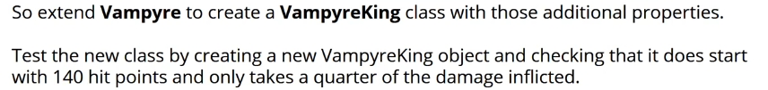

# 4. Challenge
Created Thursday 28 May 2020

Learnings:

1. We have a chained calls for init. super() accesses the parent's method.
2. Understanding that code can be very different, just like most Science - If we give a problem to 10 programmers, we will have 11 different solutions.

