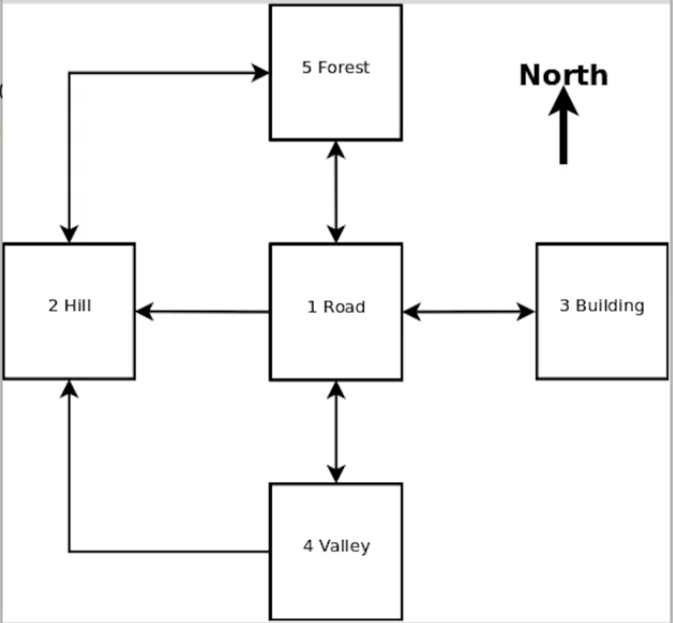
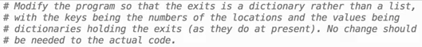
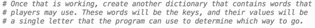

# zChallenges
Created Tuesday 12 May 2020

1. We initially created a game which used two dicts, one for names of places and other was a dict or dicts with moves available from each place. [Game challenges](../../codes/8_game_challenge.py)
2. Challenge is

Nothing much we didn't use a list anyway.

3. Challenge is

This is also do, we basically wrote a function which returns N, S, E, W, Q according to active input.
Used simple rules like length and other characteristics to figure this out.
There are many ways to do this, this was one of the ways.

*****

