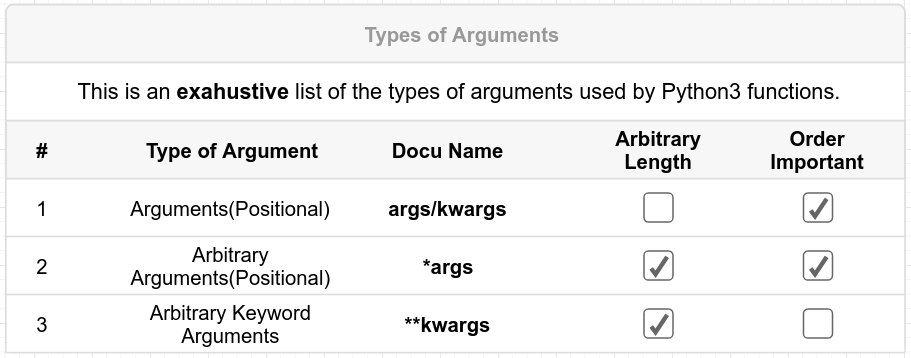

# 1. Params and Args
Created Thursday 21 May 2020

#### Types of parameters

1. Positional arguments(**args**) - One parameter per argument. They are of two type - default(skippable in call) and non-default.

	def f(i, j=2): # i, j are collectively 'called' args.
		# some code
		pass
	f(1, 2)
	f(1) # i=1, j is skippable

2. ***args** - stores multiple arguments as a tuple. **There can be only one *arg among a functions params.**

	def f(i, j, *k):
		print(k)
	f(1, 2, 3, 4) # prints (3, 4,)

3. ****kwargs** - stores multiple (new names, values) in a dictionary . **There can be only one **kwarg among a functions params.**

	def f(**kwargs):
		print(kwargs)
	f(name='Sanjar', planet='Earth') # {'name': 'Sanjar', 'planet':'Earth')

#### Order of parameters

1. Positional(non-default)
2. Positional(default) or *args - same rank, can be mixed.
3. **kwargs

* Rationale for ordering [this](./2._Params_and_Args/1._Order_of_params.md).

#### **Order of arguments**

1. Positional - must be in order and be at the start(left).
2. All other args can be in any order.
3. Order is irrelevant if all keywords are provided in the function call, e.g ``f(a=1, c=2, d=3)``

This is a very good approach:
	def f(a, *args, b=2, **kwargs):	# a good param approach

