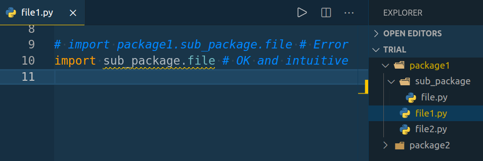

# 3. Absolute vs Relative imports
Created Tuesday 12 January 2021

This is a very messed up thing in Python. Took me 4 days to do.

#### Read this first

* The Python interpreter does not use the current directory in the import system. 
* This is good. It makes scripts runnable from anywhere.
* Instead, all imports are based on these sources:

1. sys.path - intialized using built-in, 3rd party(for example pip) and PYTHONPATH variable.
2. ``__name__`` - This is a variable that belongs to the file being executed(in any manner, i.e standalone or due to an ``import``). It is initialized by the interpreter before the file execution begins. There are two cases for intialization, where the value of ``__name__`` is set to:
	* ``__main__`` : if the file is run as a top-level script(i.e using ``python file.py``).
	* ``callers_path.fileName`` : If the file is run as a module(i.e imported from a file or using ``python -m file.py``).This ``callers_path`` is prepended  successively as you go deep in the packages.

So ``__name__`` is the information used by Python for both absolute and relative imports.

* __Just keep this **one(and only)** thing in mind during imports.__ 
* __No need to worry about in-built and 3rd party.__

#### Absolute imports
Syntax - ``import`` or ``from``-``import``, both work.

* Absolute import - path must be complete and w.r.t the root directory(top-level file's directory).
* The root directory itself is never mentioned in imports, anywhere.
* Absolute import is the recommended way to import modulles/packages.

TODO: Complete git repo

#### Relative imports
Syntax - ``from``-``import`` is the only way. [Reason](https://docs.python.org/3.8/reference/import.html?highlight=relative%20imports#package-relative-imports)

* [Not](https://stackoverflow.com/questions/14132789/relative-imports-for-the-billionth-time) applicable for the top-level scripts(error).
* Cannot import outside the root(top-level) directory.
* Use of relative import is discouraged.

	. - current directory, containing the top-level script
	.. - parent of the current directory
	... - one more level up

**Python cannot import beyond the root-directory(top-level). This is by obvious and a good design design.**

#### How to import beyond root?

* This is a very bad idea. It involves changing the **sys.path**.
* To do this, append the required path to **sys.path**, which is a list.

	import sys, os
	sys.path.append(os.path.abspath('../')) # alternatively sys.path.append(os.pardir)

#### Note

* We didn't need a ``__init__.py`` for any of this.
* Absolute and Relative are the only ways of importing modules, i.e either full_path_from_project_directory or relative import.
* The top-level script cannot have relative imports, because it the first time Python intializes ``__name__``.
* You cannot do ``import sister_package.file`` in a module(non top-level), because Python does not know anything about the directory of the module, except for the ``__name__``, either use a relative or an absolute path.

