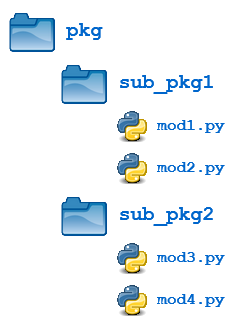

# 7. Subpackages
Created Tuesday 12 January 2021

Packages can contain **subpackages** nested to any depth.

* Most things are the same as modules and single-level packages.

#### Absolute vs Relative imports

* **Absolute** - An absolute import specifies the resource to be imported using its 
* **Relative** - A relative import specifies the resource to be imported relative to the current location—that is, the location where the *import statement* is.

* We use dot notation, think of it like
* We'll talk of only about practical examples here, things like ``from .`` or ``import .mod`` is not important, Python creator have handled it.

