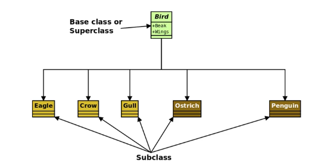
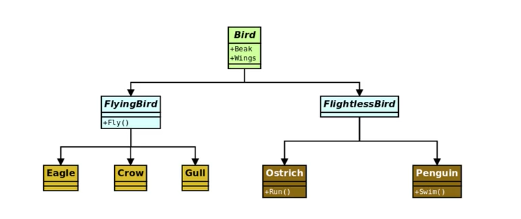
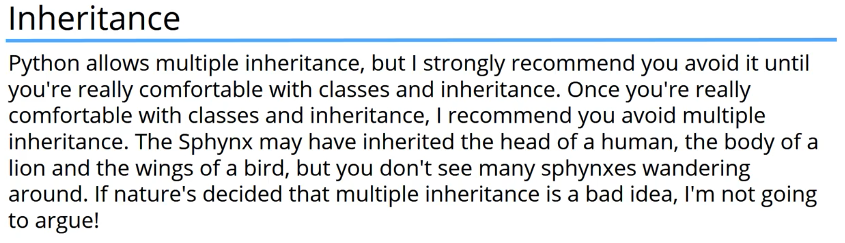

# 11. Inheritance
Created Thursday 28 May 2020

* Inheritance or cold inheritance.
* Different objects have many similar and at the same time different properties.
* These basic properties can help us classify things, and make hierarchical relations amongst them.
* Using these hierarchical structures to code our applications is called **Inheritance**.

**Another possible** hierachical structure for birds, i.e it represents the same species but in another way.

* Python supports multiple inheritance(multiple parent). Like C++.
* Multiple Inheritance should be avoided.

* MI can be extremely powerful though, if used correctly.

*****

**Is it really useful?**
Yes, it creates a natural flow in the code, and saves time. And makes the code updatable.

* Extends or Inherits from is the same thing, basic blood relations.

