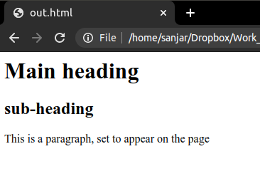

# 2. Composition
Created Thursday 28 May 2020

**Definiton**: Composition mean using other classes as components for the present class, the present class may have it's own attributes too.

* Composition & Aggregation - HAS A relationship.
* We use many classes to **make** a class, this is not inheritance. This also does not mean that inheritance is mutually exclusive to compositon, i.e we can mix them, if required.
* We use the wing, and use it for flying for our bird. [composition](./polymorphism_code/composition.py) - A example of basic composition.
* It is a very powerful technique, as we shall see.
* HTML is made up of many elements, more specifically HTML object is made of basically three things:
	1. The DTD
	2. The head
	3. The body

All these are tags themselves. These are special tags.

*****

Compostion Continued - We add the Html Doc class.
This is really awesome. Such clean code, wow!!

* This the 3rd way to do achive polymorphism in Python.

*****

When we have a HAS A - we should use composition.
When we have IS A - we should use inheritance.

