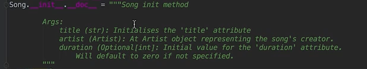

# 7.3 Writing a docstring
Created Monday 25 May 2020

* We can explicitly specify docstrings: Just assigning the thing.__doc__, but is is **discouraged**. help() works the same way.

* Docstrings are not writable in Python2.

