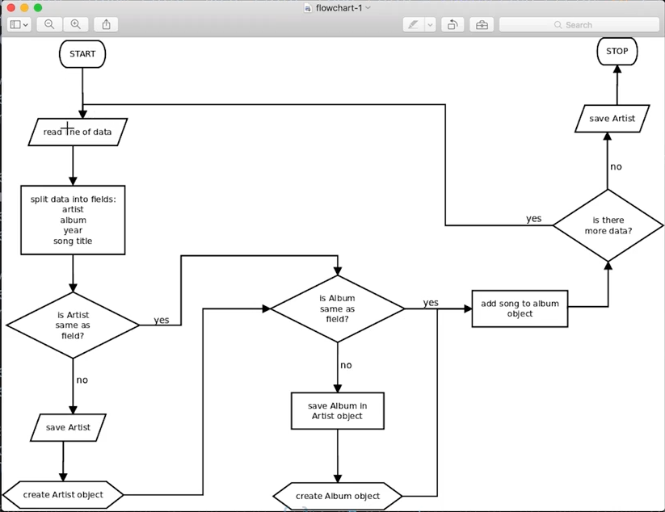
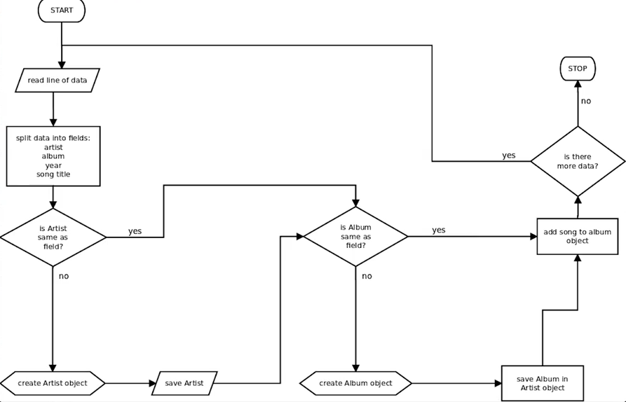
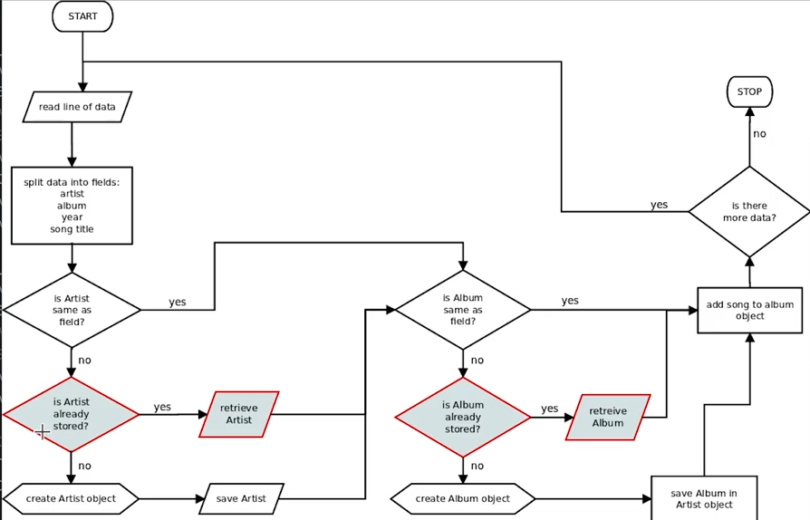

# 1. Problems
Created Wednesday 27 May 2020

* We assumed the data was sorted w.r.t the artist and the album.
* The data could be scrambled in the real world.

Problem with load_data() - Tim's approach:

1. We don't check if the artist already exists. This can create duplicate artists, which will be treated differently. Wrong.

* With some data such as financial data, it may be important to wrap the operations(insertions in this case, music library) in  a transaction, this is to maintain atomicity. Either the transaction, happens fullt, or doesn't happen at all. This ensures that no false/incomplete information is present. **This is a method.**
* This method is not required here.

*****

**Tim's corrected algorithm**

*****

**load_data1()** - lacks atomicity, but simple

*****

load_data2()  - fully independent of the order - works - exactly as Tim's

