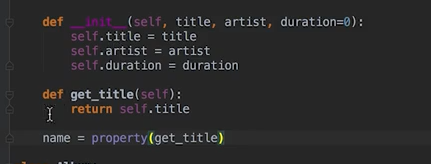
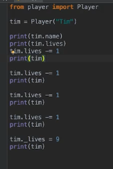
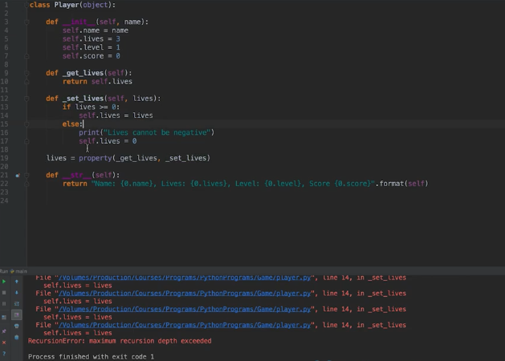

# 9. Getters and Properties
Created Wednesday 27 May 2020

**Properties:**

* A is a readonly property.
* Properties are independent data members of a class.

We do this:

and avoid this:

*****

* Properties are used to set constaints on the attributes, it's super powerful.
* They are like a trigger from SQL.
* The property lvalue is the trigger, and not the attribute - we intend to keep it private.

*****

Syntax: property_variable_name = property(gettter, setter, fdel, doc)

Some points to keep in mind:

1. **fget** getter is also optional. When **fget** is absent, the value is readonly, not that useful. 
2. **fset** setter is optional.  When **fget is absent**, this is useful for checking passwords. Something which should never be accessed directly.
3. **fdel **- deleter is optional, useful only if we have compound instance variables.
4. **doc **- provide a short description when we assign values. 
5. Keep an underscore before the name of the attribute. And property as the name which the user can update. See below.

*****

* The property must be named different from the attribute, otherwise we'll be stuck in an infinite loop.

Why: When we try to explicitly set **lives**, the class goes through the property getter and tries to set it, which again tries to set the **lives **attribute, again the property setter is called, and so on...

* This proves that a property is a class attribute.

*****

After thought - Properties help us to make our function consistent, and make Python equally capable to C++/Java.

* They are actually better than C++/Java, as we have the freedom to change variables at will. This is not encouraged though.
* And we can still do old style get/set if we want to.

[player.py](./10._Challenge/player.py)
[main.py](./10._Challenge/challenge.py) 

*****

When refactoring code, Pycharm ignores the replacement fields. Attributeerrors might pop up this way.

