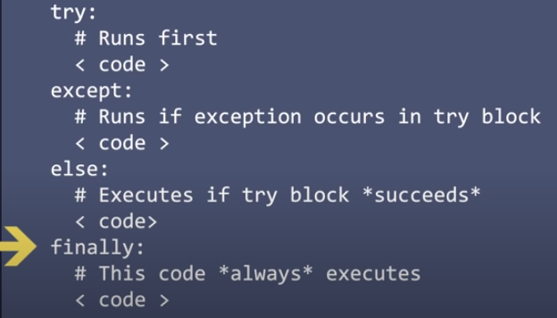
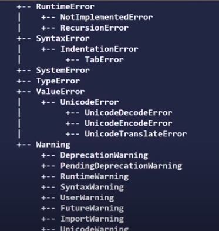

# 7. Error Handling
Created Friday 05 June 2020

Error handling is a way to save a program from stopping midway.

#### Syntax for exception handling

	try:
		pass
	except [Exception]: # providing exception(s) is optional
		pass
	[else]: # OPTIONAL - runs if no exception/error occurs
		pass
	[finally]: # OPTIONAL - runs always
		pass

Note:

* why ``else`` - just like for, while etc
* why ``finally`` - to close apps, files etc etc, saves an unecessary if. Reduces cognitive load.
* We can do it inline or in separate blocks.
* We can use ``as`` keyword for assigning errors/exception to be used. 

	# inline multiple
	try:
		pass
	except ZeroDivisionError, IOError: 
		pass
		
	# inline multiple named
	try:
		pass
	except: ZeroDivisionError as p, IOError as q:
		pass
		
	# multiple blocks
	try:
		pass
	except ZeroDivisionError:
		pass
	except IOError as b:
		pass

* Leaving the ``exception`` argument blank means that it is run on any error.

	try:
		pass
	except: # will be executed if any error occurs
		pass

#### Hierarchy of errors/exceptions
All errors/exceptions inherit from the ``BaseException`` class.

#### Raising an exception

* The ``raise`` statement allows the programmer to force a specified exception to occur
* Syntax for ``raise``

	raise ZeroDivisionError('You divided by zero')

* You can raise a arbitrary exception by using the ``Exception`` class

	raise Exception('Something happened')

#### Details about ``finally``
The ``finally`` clause has the highest priority and is run no matter what. Here are some cases:

1. If a second exception(i.e raised by the ``except`` or ``else`` ) occurs, then it is *re-raised *in the ``finally`` clause.
2. Even if keywords like ``break``, ``continue``, ``return`` appear in any clause, ``finally`` will run just before running these(``break``, ``continue``, ``return``) statements are run.
3. If the ``finally`` clause has a ``return``, then the returned value will be from the ``finally``, even if no error occurs or if the try has a ``return``.

#### Chaining exceptions
Sometimes, we want to go the root cause of the exception. This is done via chaining.
	try:
		# code
		pass
	

